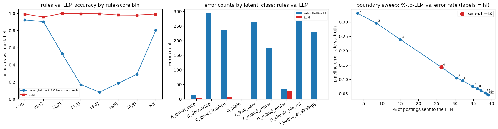
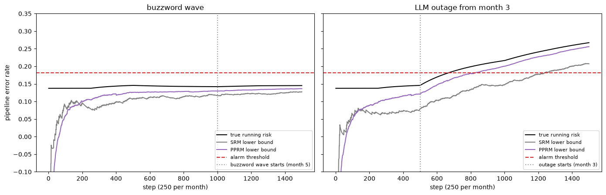

# nlp-job — auditing a hybrid rules + LLM text classifier, with guarantees

A synthetic-data project on a common production pattern: a text-classification pipeline built from
cheap keyword-taxonomy rules plus an LLM fallback tier for whatever the rules can't resolve — here,
deciding whether a job posting genuinely involves substantive GenAI/LLM work, as opposed to buzzwords,
mere tool use, classic (non-generative) ML/NLP, or AI strategy talk with no hands-on building. Three
notebooks, in order:

1. **`notebooks/01_research_foundations.ipynb`** — the math behind every statistical guarantee used
   later, each verified against known-truth simulations with confidence intervals rather than a single
   number and a "looks right."
2. **`notebooks/02_project_walkthrough_part1.ipynb`** — builds a synthetic corpus of 4,800 job postings
   with a *known* latent ground truth, a rule-based scorer, a real LLM classification tier, and an audit
   baseline.
3. **`notebooks/03_project_walkthrough_part2.ipynb`** — certified routing between the rules and the LLM,
   a prediction-powered evaluation of monthly accuracy from a small human audit, a harmful-vs-harmless
   drift monitor, near-duplicate dedup, and a cost breakdown.

All data here is synthetic, generated by a seeded simulator with a known ground-truth response surface —
there is no real employer, posting, or company data anywhere in this repository. The LLM calls are real
(DeepSeek `deepseek-flash`, disk-cached so re-running costs nothing).

## Findings

- **A plain keyword-taxonomy rule tier gets a quarter of postings wrong, unevenly.** Across all 4,800
  postings, the rule tier (plus its documented fallback for ambiguous scores) makes 1,513 classification
  errors versus 39 for the LLM tier. The rules are at their worst on postings that describe real GenAI
  work in plain language without hitting the taxonomy's exact terms (100% error rate on that class) —
  the LLM's worst class still only errs 10.8% of the time.
- **Moving the rule/LLM boundary is a real, measurable trade.** Sweeping the rule-score cutoff that
  routes postings to the LLM shows pipeline error falling from 14.2% to 4.6% as the share sent to the
  LLM rises from 26.3% to 39.2% — a concrete cost/accuracy curve instead of a guess.
  
- **Certifying the rules against the LLM (not against truth) is possible, but the rules' own
  confidence is badly calibrated.** A BARGAIN-style adaptive-sampling certifier can guarantee the
  rules agree with the LLM at least 90% of the time with only 10% risk of being wrong — but because the
  rule score barely tracks agreement with the LLM, that guarantee only lets the rules answer a small
  fraction of postings on their own before the LLM has to take over the rest.
- **A 100-label monthly audit becomes far more informative when paired with the right predictor.**
  Prediction-powered inference on the LLM's own labels shrinks the confidence interval on monthly
  prevalence to roughly half the width of a classical estimate from the same 100 human labels — and
  every interval's coverage was checked to actually hold, not just assumed.
- **A harmless "the data looks different" wave and a harmful accuracy drop are not the same thing, and
  a monitor should know it.** A synthetic monthly wave of buzzword-heavy postings changes the data
  enough that a naive frequency test flags it — but pipeline accuracy doesn't move, and the drift monitor
  correctly stays silent. A simulated LLM-tier outage, which *does* hurt accuracy, is caught reliably —
  and faster than watching human-only labels alone when the auxiliary signal is informative.
  

See `notebooks/README.md` for a notebook-by-notebook technical breakdown, and `research-notes/` for the
statistics behind each result — an intuitive description, the mathematical formalism, and exactly where
in the notebooks each one gets applied.

## Layout

```
nlp-job/
├── notebooks/
│   ├── 01_research_foundations.ipynb
│   ├── 02_project_walkthrough_part1.ipynb
│   ├── 03_project_walkthrough_part2.ipynb
│   └── README.md            # internal notebook-by-notebook technical notes
├── research-notes/          # the statistics behind it: intuition, formalism, where it's applied
├── assets/                  # figures referenced by this README
└── data/                    # on-disk LLM response cache (regenerates on first run)
```

## Running it

```bash
cd notebooks
uvx --python 3.12 --from nbconvert --with ipykernel --with numpy --with matplotlib --with pydantic \
  jupyter-nbconvert --to notebook --execute --inplace --ExecutePreprocessor.timeout=1800 \
  01_research_foundations.ipynb 02_project_walkthrough_part1.ipynb 03_project_walkthrough_part2.ipynb
```

A DeepSeek API key is only needed to regenerate the LLM-scored cells from scratch; set `DEEPSEEK_KEY`
in your environment first if you want a live (uncached) run. Notebooks 2 and 3 read/write a small
on-disk cache under `data/llm_cache/`, so a second run of the same cells makes no live API calls.
